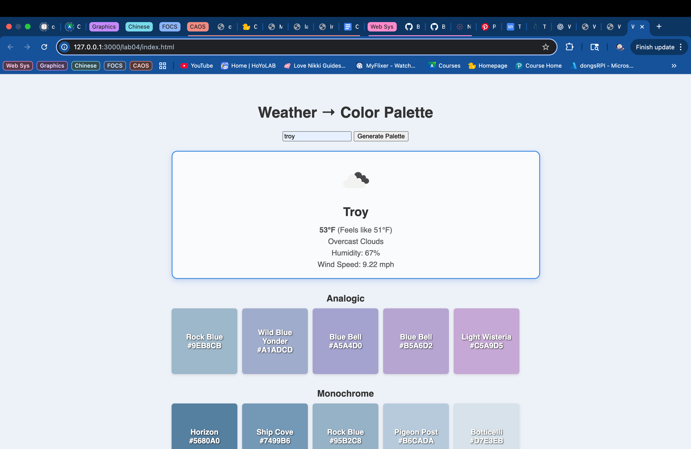

Weather Color Palette generates different color palletes depending on the weather. 

This lab explored the limitations of Generative AI. This website was all made by ChatGPT. 
There was minimal setbacks with the code but formatting and presentation of the wepage became a issue.

List of my Prompts in into ChatGPT:
1. use open weather api and https://www.thecolorapi.com/ to create a website that generates color palates based on the weather
2. please split it into seperate files
3. use https://api.openweathermap.org/data/2.5/weather
4. display the weather
5. why does the get weather not work
6. add the names of the colors to the page
7. return the temp in F not C
8. the temperature is wrong 
9. make the code account for the time of day as well when it comes to generating colors
10. return all the code in its respective file
11. generate at least 3 different palletes to pick from
12. display the palletes horizontally
13. the boxes should all be the same size 
14. make the weather display bigger and have more information
15. have the weather displayed in the center with a box around it
16. center the text and have the box hidden when the weather is not diplayed
17. the weather info is not centered in the box
19. make all the color pallettes align
20. center the color pallettes on the page
21. display all the js
22. center the pallette title and color swatches to the middle of the page it is currently skewed right
23. add some color to the website
24. change the color swatches back to squares
25. when the initial generate pallette is displayed alone on the screen center it on the screen and make it larger
26. I meant the Weather → Color Palette
Enter city name (e.g. New York)
 Generate Palette
27. after the button is clicked center all the content at the top of the page
28. return all the css
29. return the fixed code for generate function
30. make the color swatches bigger and make it possible to put in another city after
31. Error: Cannot read properties of null (reading 'style')
32. now the color swatches arent displaying
33. fix the weather text box since it is still off center ad slightly skewed right
34. the box is till skewed can you see why it is off center
35.  this is what i mean by the displayed weather box is skewed. also pls make the box around 30% smaller
36. set the weather box width to be the same as the entire color palette
37. provide all the css 
38. have the initial Weather → Color Palette
Enter city name (e.g. New York)
 Generate Palette display be large and centered before generating the color palette
39. the inital screen is aligned left and you removed the ability to put in another coity and generate a new palette again after hitting generate
